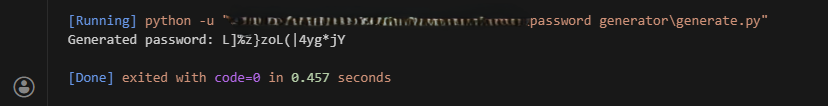

# Password Generator
This project is based on the freeCodeCamp Scientific Computing with Python curriculum. It implements **Regex** to enforce password strength by validating the required mix of symbols, numbers, and letters.

**↳** The generated password will be random everytime you run the code!

## Features
* **Customizable Length**: Set exactly how long you want your password to be (defaults to 16 characters).
* **Security-Focused**: Uses the secrets module, which is cryptographically stronger than the standard random library.
* **Smart Constraints**: You can specify a minimum count for numbers, special characters, uppercase, and lowercase letters.
* **Guaranteed Quality**: The script doesn't just hope for the best but it checks the password against your rules and re-generates it if they aren't met.

## Project Structure
Inside this repository, you will find:
* `generate.py` — The main Python script to generate password.
* `README.md` — The documentation you are reading right now.
* `output.png` — A screenshot of an example output when you run the code.

## How The Logic works
The script follows a "generate and verify" loop to make sure the password is secure. Here's a step-by-step explanation of the logic: 

1. **Character Pool**: It creates a massive list of every possible character—letters (big and small), numbers, and symbols.

2. **Random Selection**: It picks characters at random from that pool until it reaches your desired length.

3. **The "Safety Check"**: Instead of just giving you the password, it uses Regular Expressions `(Regex)` to count how many digits, symbols, and letters are actually in the result.

4. **Validation Loop**: If the password meets all your minimum requirements (e.g., at least one number, one symbol, etc.), the loop breaks and returns the password. But if it fails even one requirement, it throws that password away and starts back at **Step 2**.